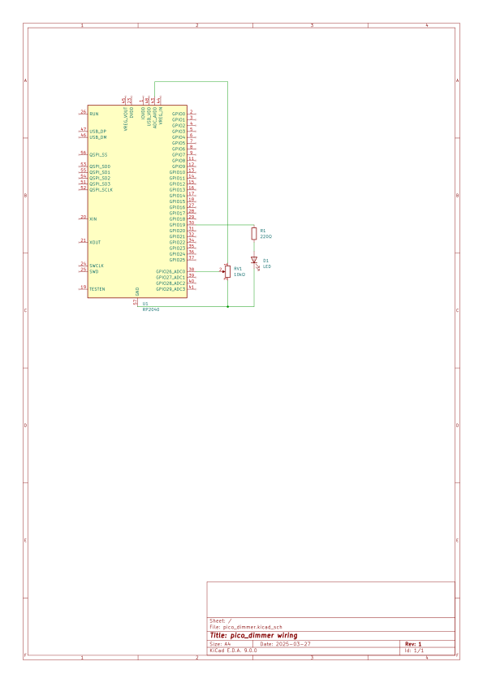

pico_dimmer
===========

## Summary

The pico_dimmer program is a basic Raspberry Pi Pico program demo that uses ADC to read from a 10K potentiometer and PWM to drive the light level of an LED.

## Setup

* You can install the Pico SDK using instructions at the [Raspberry Pi documentation site](https://datasheets.raspberrypi.com/pico/getting-started-with-pico.pdf).
* To make things easier you can use Nix with the provided flake.
    * Install Nix using [the provided instructions](https://nix.dev/manual/nix/2.26/installation/installing-binary).
    * Make sure to enable flakes, see [this page on Nix flakes](https://nixos.wiki/wiki/Flakes).
    * Run `nix develop` in the base directory.

## Build

For now this is manual (working on a `nix build` step as my next TODO):

* If using the nix flake, make sure you are in the `nix develop` shell by typing that command in the base directory.
* Make a `build/` directory and `cd` into it.
* Run `cmake ..` to create the required makefile. 
    * Nix will make sure the Pico SDK library is available.
    * If not using Nix, see the documentation above about setting up your dev environment.
* Run `make -j<num_cores>` where `<num_cores>` is the number of cores in your development environment.
    * Make does not detect this for some reason.
    * If in doubt, leave it blank, it will still compile, albeit slower.
* Confirm that a `pico_dimmer.uf2` file was created.

## Hardware and RP2040 setup

Here is a diagram of the intended wiring (drawn in KiCad):


Steps to wiring on the breadboard:
* Place the RP2040 on a breadboard.
* LED setup through GP19:
    * Connect pin 19 to a current-limiting resistor (I used a 220-ohm resistor, colored red-red-brown)
    * Connect your resistor to an LED (the cathode or "flat side" of the LED)
    * connect the rounded side (anode) to ground.
* Potentiometer setup through GP26 (ADC 0)
    * Connect the middle lead (wiper) to GP26
    * Connect the outer two leads to ground and 3.3V (polarity doesn't really matter on this, but I connected left to ground)
    * You can get ground on the RP2040 from pin 38, and 3.3V from pin 36 (3v3). Be careful: pin 37 (3v3_EN) will turn off the Pi Pico, pin 39 (VSYS) can vary according to the datasheet, and pin 40 (VBUS) is the USB voltage at 5V, which is too high for the ADC.
* Power the RP2040 through the micro-USB plug to your dev computer.

## Loading the code onto the RP2040

* Again, if using the nix flake, make sure you are in the `nix develop` shell by typing that command in the base directory.
* Make sure `picotool` is installed (if you use the flake, it's already there). It should come with the Pico SDK install.
* IMPORTANT: hold down the BOOTSEL button on the RP2040 when powering it up (little white button on upper middle left near the micro-USB port)
* Connect the RP2040 to your dev computer and power it up
* RELEASE the BOOTSEL button. This puts your RP2040 into `BOOTSEL` mode, meaning you can load code/config onto it.
* To confirm, run `picotool info` (you may need permissions to connect to the USB from console, if so use `sudo picotool info`)
  * The output will tell you explicitly if the RP2040 is not connected (`No accessible RP-series devices in BOOTSEL mode were found.`)
  * Otherwise it will give you info on what is on the RP2040. NOTE: loading this code will wipe out what is currently on the RP2040. You can use `picotool save` to record this information, but usage of that commmand is outside the bounds of these instructions.
* in the `build/` you created in the Build step above, run `picotool load pico_dimmer.uf2`
* Confirm the code is loaded by running `picotool info` again. Output should show something like:

```
    Program Information
     name:          pico_dimmer
     web site:      https://github.com/ironhandedlayman/pico_dimmer
     features:      USB stdin / stdout
     binary start:  0x10000000
     binary end:    0x100081d4
```

## Running the code

* After the code is loaded, you can run it from `BOOTSEL` mode by using `picotool reboot`, or by disconnecting/reconnecting the micro-USB from the computer.
* You don't need to connect it to a computer at this point, code can run from just a 5W USB adapter (RP2040 doesn't draw that much power at all, datasheet gives no values over 40mA, which at 5 volts is 2 tenths of a watt, so this won't blow out most USB adapters)
* Debugging:
    * You can see the console output from a program called `minicom`:
        * Run `minicom -b 115200 -o -D /dev/ttyACM0` to get STDIN/STDOUT from the code
            * Breakdown of command:
                * `-b 115200` sets serial comms to 115200 baud
                * `-o` no initialization needed to connect to pseudo port
                * `-D /dev/ttyACM0`: RP2040 will emulate a serial device port when connected to a computer. This is the linux device it connects to every time. For other systems your mileage may vary.
        * At present, code will show a reading every 250ms of the pot setting in raw ADC format (12-bit number) and translated voltage (assuming 3.3v).
    * The Nix flake also provides openocd, but I am still learning how to hook that up.

## TODO

* [X] Add wiring diagram to make things clearer
* [ ] Add `nix build` command to flake
* [ ] Add install script to drop .uf2 file onto RP2040 for faster interation
* [ ] Add some digital readout of the output of the ADC on the breadboard.


